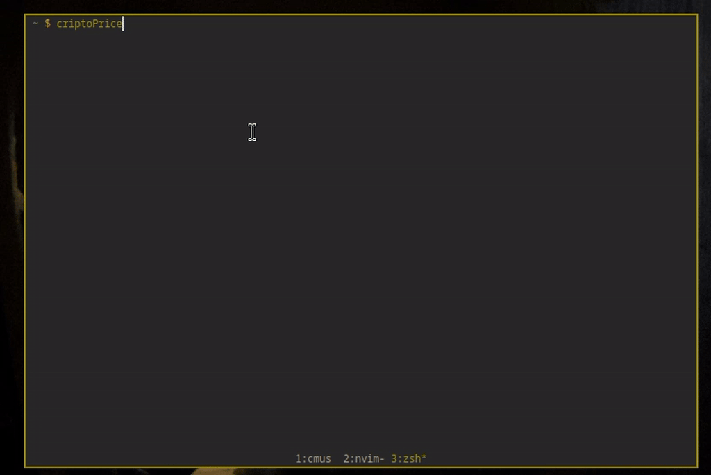

<h1 align="center">View Any Cripto price in terminal</h1>
<p align="center">Simple cURL and JQ script</p>

##
<p align="center">

</p>

Watch Mashed [video](https://youtu.be/PcrhBHvcouo) on this

### Install 
```
curl -s "https://raw.githubusercontent.com/rabpaulo/AnyCriptoPriceInTerminal/main/criptoPrice" > ~/.local/bin/criptoPrice
sudo chmod +x ~/.local/bin/criptoPrice
```

### Usage
Change the COINS and CURRENCY to your needs and run the command.

### Update
Just redo the curl command

### Unistall
`sudo rm ~/.local/bin/criptoPrice`

### License
[GPL 3.0](https://raw.githubusercontent.com/Edesem/BTCPriceInTerminal/main/LICENSE)
